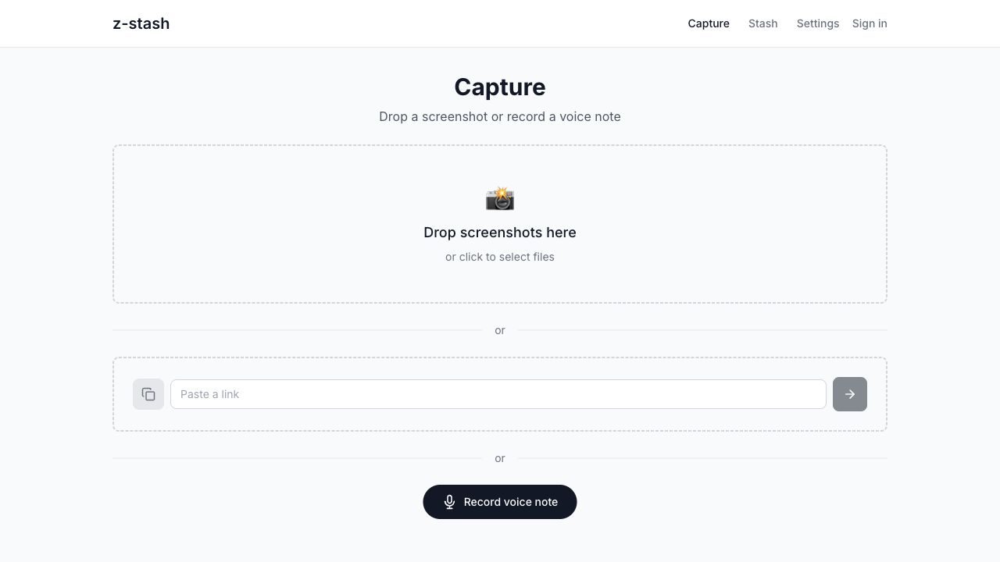
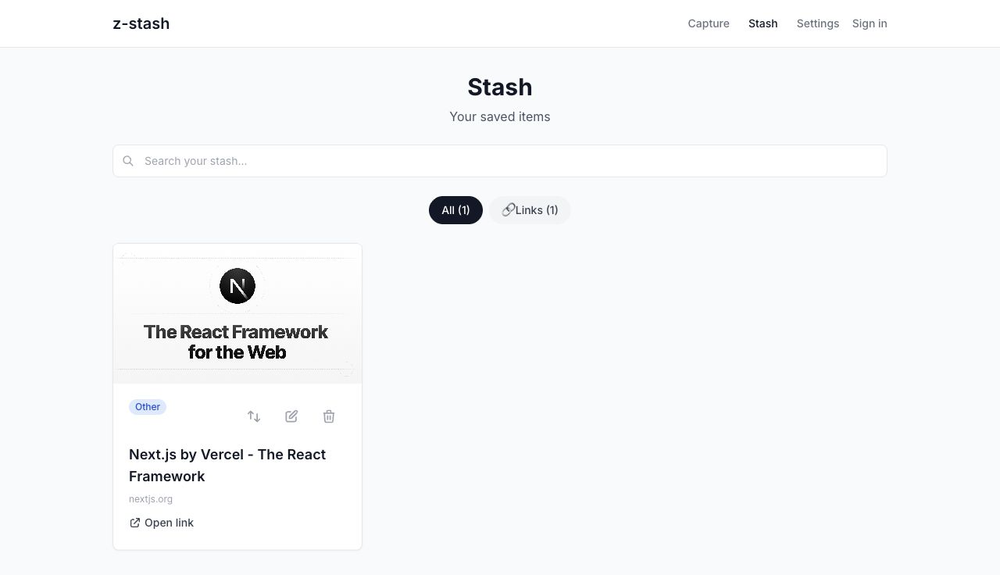

<div align="center">

# z-stash

**A mobile-first PWA that turns screenshots, links, and voice notes into an AI-enriched personal knowledge stash.**

[](https://github.com/AndreiZitti/z-stash/actions/workflows/ci.yml)
[](https://nextjs.org/)
[](https://www.typescriptlang.org/)
[](LICENSE)

[Hosted app](https://stash.zitti.ro) · [Deployment checklist](docs/DEPLOYMENT_CHECKLIST.md) · [Control API](docs/API.md)

</div>

<p align="center">
  
  
</p>

## Why z-stash?

Screenshots and quick voice notes are easy to capture and easy to forget. z-stash turns them into useful, searchable records:

- Upload one or more screenshots and let Gemini identify and enrich what they contain.
- Save links immediately, then enrich them with a description and tags in the background.
- Record voice notes and transcribe them into the same searchable Stash.
- Keep capturing offline; IndexedDB queues work until the connection returns.
- Send discoveries and links to one or more Notion pages.
- Install the app on a phone as a portrait-oriented PWA.

The hosted instance is private and allowlisted. The repository is designed to be self-hosted for your own account or small group.

## How it works

1. Captures are stored in IndexedDB first so the UI remains responsive and usable offline.
2. Gemini analyzes screenshots, enriches links, and transcribes voice notes.
3. Authenticated clients synchronize discoveries and links to Supabase with RLS protection.
4. Items can optionally be copied or moved to Notion.

Voice notes use the same `discoveries` model as other captures (`type = "note"`). The migration history automatically consolidates older standalone note records.

## Quick start

Requirements: Node.js 24, npm, a Supabase project, and a Gemini API key.

```bash
git clone https://github.com/AndreiZitti/z-stash.git
cd z-stash
nvm use
npm ci
cp .env.example .env.local
npm run dev
```

Fill in `.env.local`, then apply every SQL file in `supabase/migrations/` in filename order. The app is available at `http://localhost:3000`.

### Environment variables

| Variable                        |   Required | Purpose                                                                 |
| ------------------------------- | ---------: | ----------------------------------------------------------------------- |
| `NEXT_PUBLIC_SUPABASE_URL`      |        Yes | Supabase project URL                                                    |
| `NEXT_PUBLIC_SUPABASE_ANON_KEY` |        Yes | Supabase anonymous key                                                  |
| `GEMINI_API_KEY`                |        Yes | Shared fallback key for analysis, enrichment, and transcription         |
| `APP_ALLOWED_EMAILS`            | Production | Comma-separated email allowlist; production fails closed when empty     |
| `NEXT_PUBLIC_COOKIE_DOMAIN`     |         No | Shared cookie domain such as `.example.com`; omit for host-only cookies |
| `GEMINI_MODEL`                  |         No | Gemini model override; defaults to `gemini-2.5-flash`                   |
| `NOTION_API_KEY`                |         No | Owner-level fallback Notion token                                       |
| `NOTION_PAGE_ID`                |         No | Owner-level fallback Notion page                                        |

Users can store their own Gemini key and Notion connections from Settings. Disable public signup in Supabase unless new accounts should be able to request access.

## Quality checks

```bash
npm run lint
npm run typecheck
npm test
npm run build

# Run the complete release gate
npm run check
```

CI runs the same lint, typecheck, test, and production-build checks on pushes and pull requests.

## PWA and offline behavior

The web manifest, owned service worker, responsive navigation, safe-area spacing, and local-first data layer make z-stash installable and useful on mobile. The service worker caches the static shell and previously visited pages, while capture data remains in IndexedDB until it can sync.

Test service-worker behavior with a production build (`npm run build && npm start`); registration is intentionally disabled during development.

## Documentation

- [Programmatic control API](docs/API.md)
- [Deployment and post-deploy checklist](docs/DEPLOYMENT_CHECKLIST.md)
- [Security policy](SECURITY.md)
- [Contributing](CONTRIBUTING.md)
- Historical design notes live in `docs/plans/`.

## License

MIT © 2026 Andrei Zitti. See [LICENSE](LICENSE).
